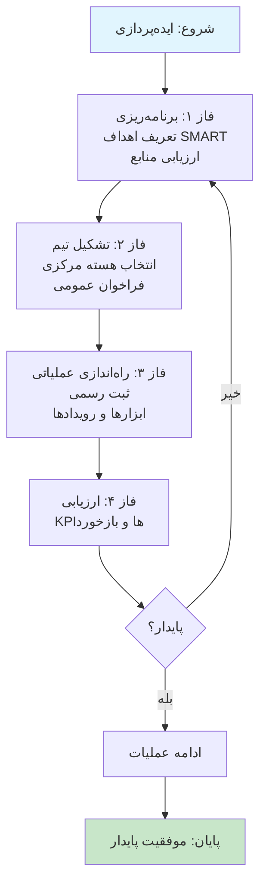
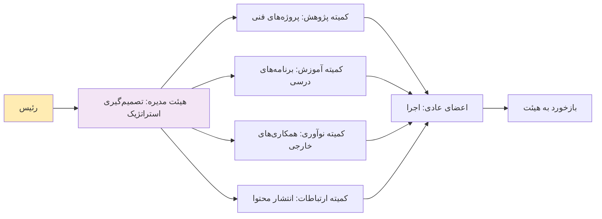
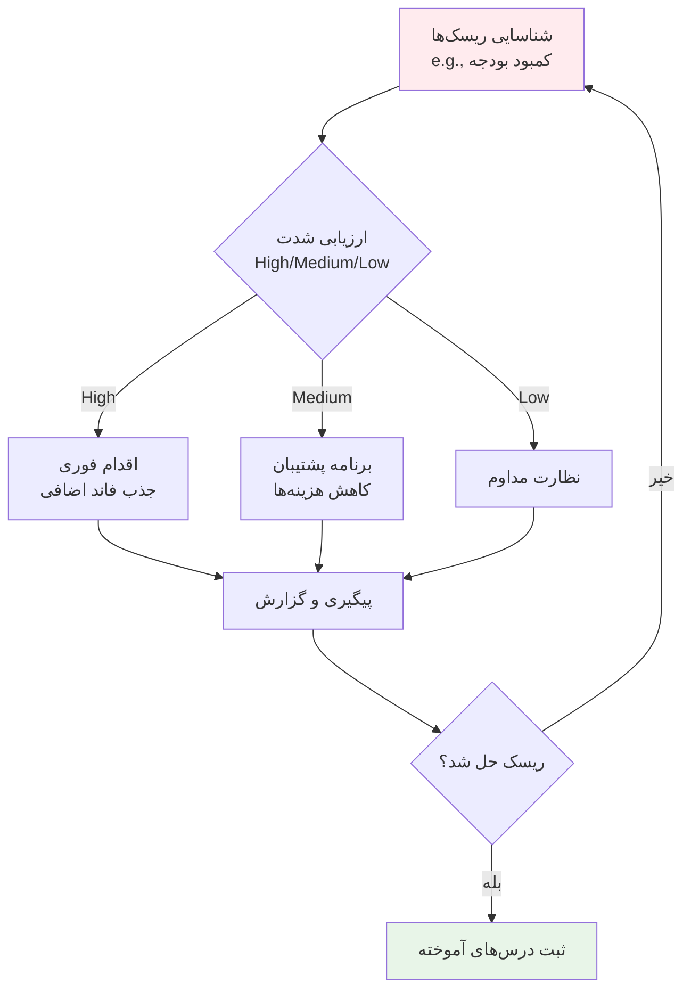

## مقدمه

کارگروه هوش مصنوعی دانشگاه فردوسی مشهد، با الهام از میراث گران‌بهای حکیم فردوسی در احیای زبان و خرد فارسی، در دل یکی از پیشروترین دانشگاه‌های کشور متولد شده است. ماموریت ما، پیشبرد مرزهای دانش و فناوری در حوزه هوش مصنوعی از طریق ایجاد یک اکوسیستم پویای پژوهشی، آموزشی و نوآوری است. این کارگروه بستری برای گردهمایی نخبگان، دانشجویان و صنعتگران است تا با تلفیق اصالت علمی و نوآوری، به قلب تپنده تحول دیجیتال در شرق ایران و پیشگام عرصه فناوری‌های هوشمند در کشور تبدیل شویم.

در این سند، به صورت دقیق و فنی، روش‌های شروع و راه‌اندازی کارگروه، نکات کلیدی، ساختار کاری، و تمام جنبه‌های لازم برای موفقیت آن را بررسی می‌کنیم. این راهنما بر اساس بهترین شیوه‌های مدیریت پروژه‌های دانشگاهی و اکوسیستم‌های نوآوری تدوین شده است. برای visualization مراحل، از فلوچارت‌های حرفه‌ای با استفاده از Mermaid (قابل رندر در GitHub Pages) بهره می‌بریم.

---

## ۱. روش شروع و راه‌اندازی کارگروه

راه‌اندازی یک کارگروه دانشگاهی مانند کارگروه هوش مصنوعی نیازمند رویکرد سیستماتیک است. این فرآیند را می‌توان به چهار فاز اصلی تقسیم کرد: **برنامه‌ریزی اولیه**، **تشکیل تیم**، **راه‌اندازی عملیاتی**، و **ارزیابی و پایداری**. هر فاز شامل مراحل فنی و عملی است.

### مراحل اولیه (فاز ۱: برنامه‌ریزی)
- **تعریف اهداف و دامنه**: اهداف SMART (Specific, Measurable, Achievable, Relevant, Time-bound) تعریف کنید. مثلاً: "راه‌اندازی ۵ پروژه پژوهشی AI در سال اول با همکاری ۲۰ دانشجو."
- **ارزیابی منابع**: بررسی بودجه دانشگاهی، امکانات آزمایشگاهی (مانند GPU سرورها برای مدل‌های AI)، و حمایت‌های حقوقی (مانند مجوزهای اخلاقی برای داده‌های AI).
- **شناسایی ذی‌نفعان**: فهرست اساتید، دانشجویان، و شرکای صنعتی (مانند شرکت‌های فناوری در مشهد).

### تشکیل تیم (فاز ۲)
- **انتخاب هسته مرکزی**: حداقل ۳-۵ عضو کلیدی (رئیس، معاون پژوهشی، مسئول آموزشی).
- **فراخوان عمومی**: از طریق ایمیل‌های دانشگاهی، گروه‌های تلگرامی/دیسکورد، و پوسترهای دیجیتال.
- **مصاحبه و انتخاب**: بر اساس رزومه (GitHub، مقالات Scopus)، و مهارت‌های فنی (Python, TensorFlow, NLP).

### راه‌اندازی عملیاتی (فاز ۳)
- **ثبت رسمی**: تشکیل پرونده در معاونت پژوهشی دانشگاه فردوسی، با اساسنامه (شامل قوانین عضویت، جلسات، و بودجه).
- **راه‌اندازی ابزارها**: پلتفرم‌های collaborative مانند GitHub برای کد، Slack/Teams برای ارتباطات، و Google Workspace برای اسناد.
- **برنامه‌ریزی رویدادها**: اولین وبینار یا ورکشاپ در ماه اول.

### ارزیابی و پایداری (فاز ۴)
- **KPIها**: اندازه‌گیری موفقیت با معیارهایی مانند تعداد مقالات منتشرشده، شرکت‌کنندگان در رویدادها، و بودجه جذب‌شده.
- **بازخورد مداوم**: نظرسنجی‌های پس از هر رویداد.

### فلوچارت مراحل راه‌اندازی

---

## ۲. ساختار کاری کارگروه

ساختار کاری باید سلسله‌مراتبی اما انعطاف‌پذیر باشد تا نوآوری را تشویق کند. بر اساس مدل‌های استاندارد دانشگاهی (مانند IEEE Chapters)، ساختار پیشنهادی به شرح زیر است:

### سطوح سلسله‌مراتبی
- **هیئت مدیره (Board)**: 
  - رئیس (Chair): رهبری کلی، نمایندگی در دانشگاه.
  - معاون پژوهشی (VP Research): مدیریت پروژه‌های AI (مانند مدل‌های یادگیری عمیق).
  - معاون آموزشی (VP Education): برنامه‌ریزی دوره‌ها (Coursera-like workshops).
  - خزانه‌دار (Treasurer): مدیریت بودجه (از دانشگاه، اسپانسرها).
- **کمیته‌های تخصصی**:
  - کمیته پژوهش: تمرکز روی مقالات، کنفرانس‌ها (e.g., NeurIPS submissions).
  - کمیته آموزش: ورکشاپ‌ها، گواهینامه‌ها (e.g., TensorFlow certification).
  - کمیته نوآوری: همکاری با صنعت (e.g., هکاتون‌های AI با شرکت‌های محلی).
  - کمیته ارتباطات: مدیریت وبسایت، شبکه‌های اجتماعی (X, LinkedIn).
- **اعضای عادی**: دانشجویان و پژوهشگران، با نقش‌های چرخشی (rotating roles) هر ۶ ماه.

### ابزارهای فنی برای ساختار
- **مدیریت پروژه**: Trello/Jira برای تسک‌ها (e.g., backlog برای پروژه‌های AI).
- **جلسات**: Zoom برای جلسات هفتگی، با agenda از Google Docs.
- **امنیت داده**: رعایت GDPR-like برای داده‌های AI، با ابزارهایی مانند Hugging Face برای مدل‌های امن.

### جدول نقش‌ها و مسئولیت‌ها
| نقش              | مسئولیت‌های کلیدی                          | مهارت‌های مورد نیاز              | مدت زمان |
|------------------|---------------------------------------------|-----------------------------------|-----------|
| رئیس            | رهبری، گزارش‌دهی به دانشگاه               | مدیریت، شبکه‌سازی               | ۱-۲ سال  |
| معاون پژوهشی   | نظارت بر پروژه‌ها (e.g., CV models)       | Python, PyTorch                   | ۱ سال    |
| معاون آموزشی   | طراحی دوره‌ها (e.g., NLP basics)           | تدریس، ابزارهای LMS             | ۶ ماه    |
| خزانه‌دار      | بودجه‌بندی، جذب فاند                      | حسابداری، Grant writing          | ۱ سال    |
| اعضای کمیته    | اجرای رویدادها (e.g., webinars)            | مهارت‌های فنی AI                 | چرخشی   |

### فلوچارت ساختار تصمیم‌گیری

---

## ۳. نکات مهم در راه‌اندازی و مدیریت

برای موفقیت، نکات زیر را به صورت فنی و عملی رعایت کنید:

### نکات فنی
- **انتخاب فناوری‌های پایه**: از اکوسیستم Python (NumPy, Scikit-learn, Transformers) شروع کنید. سرورهای ابری مانند Google Colab برای دسترسی اولیه.
- **مدیریت داده**: استفاده از Kaggle datasets برای آموزش، با تمرکز روی داده‌های فارسی (e.g., Persian NLP corpora).
- **امنیت و اخلاق**: پیاده‌سازی bias detection در مدل‌های AI با ابزارهایی مانند Fairlearn. اخذ مجوز IRB برای پروژه‌های انسانی.

### نکات مدیریتی
- **بودجه**: شروع با بودجه دانشگاهی (e.g., ۵۰ میلیون تومان اولیه)، سپس جذب از صندوق نوآوری (e.g., INIF).
- **ریسک‌ها**: ریسک کمبود نیروی متخصص → راه‌حل: همکاری با دانشگاه‌های دیگر. ریسک burnout → جلسات wellness.
- **پایداری**: حداقل ۲ رویداد در ماه برای حفظ momentum. پیگیری alumni برای mentorship.
- **اندازه‌گیری موفقیت**: استفاده از metrics مانند GitHub stars برای پروژه‌ها، یا citation count در Google Scholar.

### لیست چک (Checklist) راه‌اندازی
- [ ] تعریف اساسنامه (قانونی).
- [ ] راه‌اندازی وبسایت (این سایت: https://computerdepartmentferdowsiuniv.github.io/).
- [ ] ایجاد گروه‌های ارتباطی (Discord/Slack).
- [ ] برنامه‌ریزی اولین رویداد (e.g., AI Intro Workshop).
- [ ] ثبت KPI baseline.
- [ ] آموزش اولیه به اعضا (e.g., Git workflow).

### فلوچارت مدیریت ریسک

---

## ۴. نتیجه‌گیری و گام‌های بعدی

راه‌اندازی کارگروه هوش مصنوعی دانشگاه فردوسی مشهد نه تنها یک پروژه فنی، بلکه یک حرکت فرهنگی برای احیای خرد فارسی در عصر دیجیتال است. با پیروی از این راهنما، می‌توانید اکوسیستمی پویا بسازید. گام بعدی: تشکیل جلسه اولیه هیئت مدیره در هفته آینده.

برای به‌روزرسانی این سند، از GitHub issues استفاده کنید. تماس: [ایمیل/شماره تماس کارگروه].

*این سند در تاریخ ۱۸ سپتامبر ۲۰۲۵ تدوین شده است. نسخه ۱.۰*